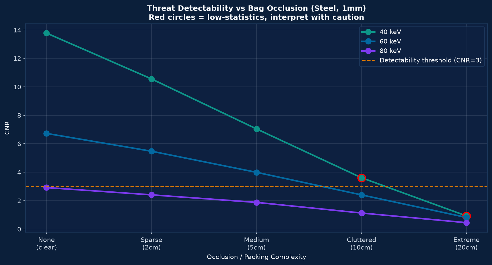
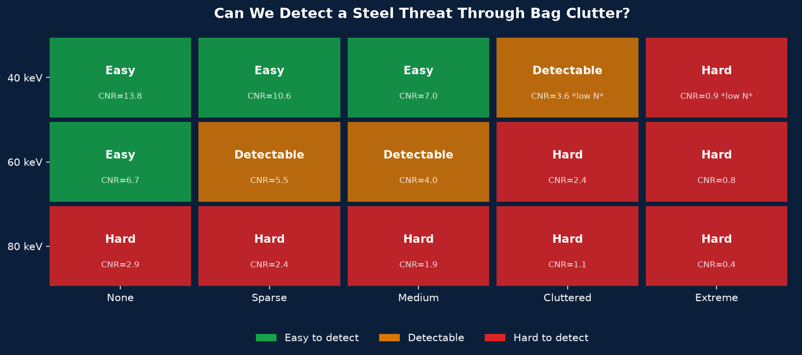
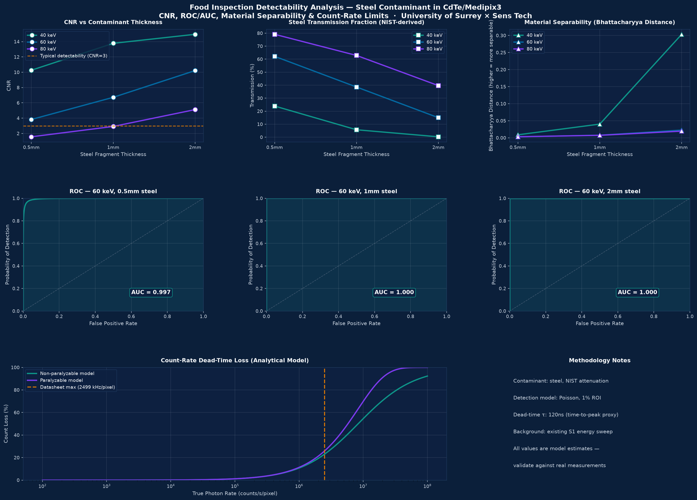
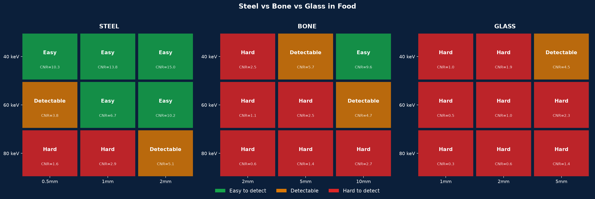
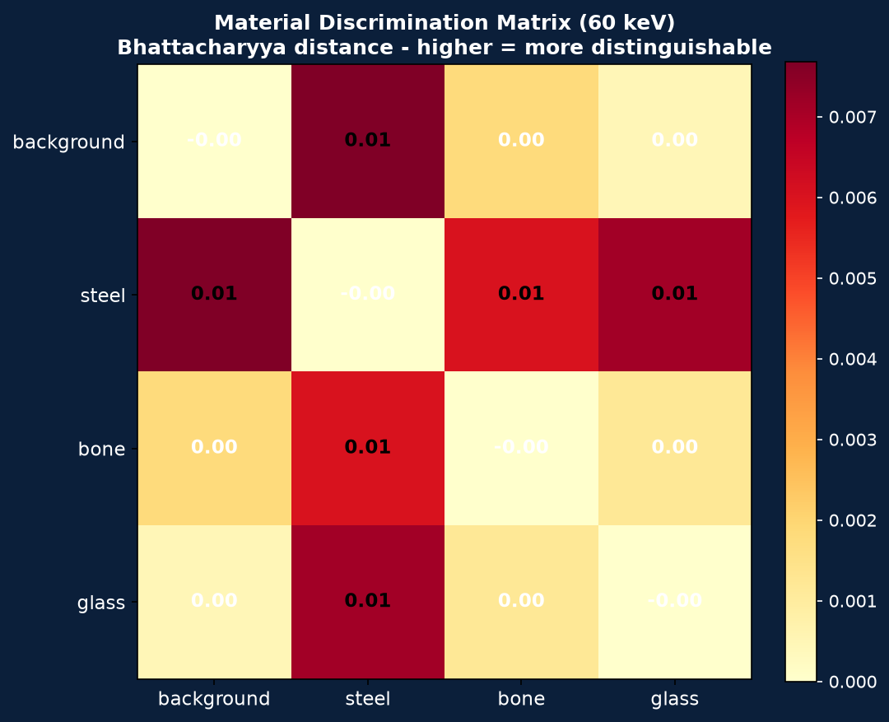
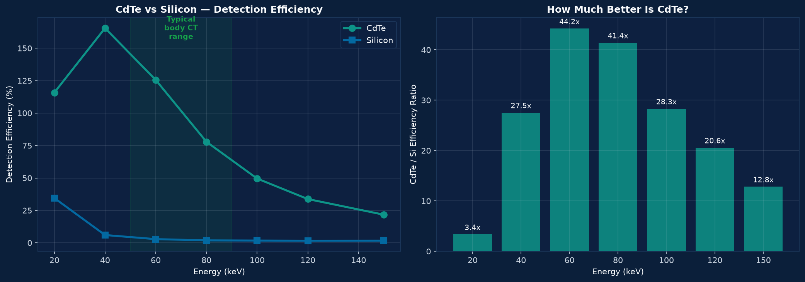
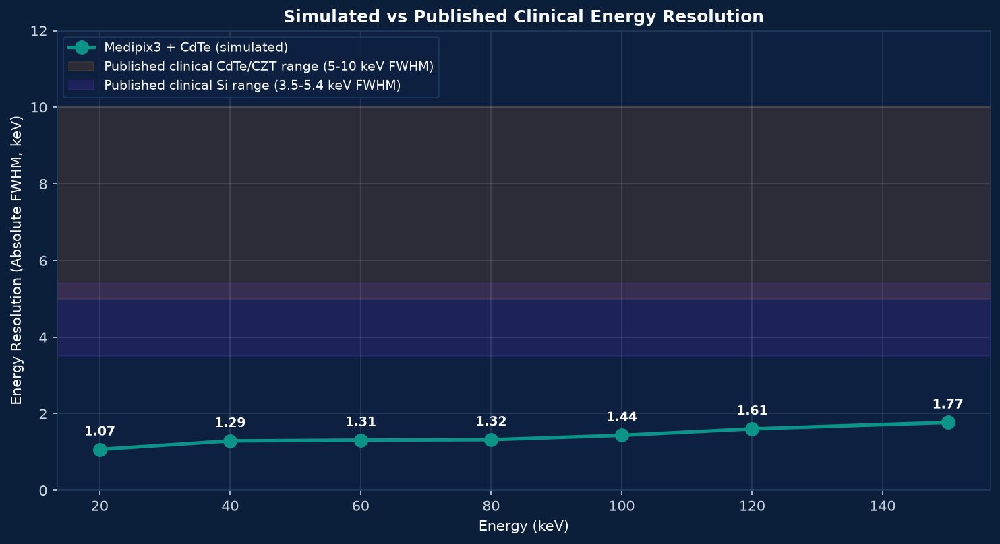
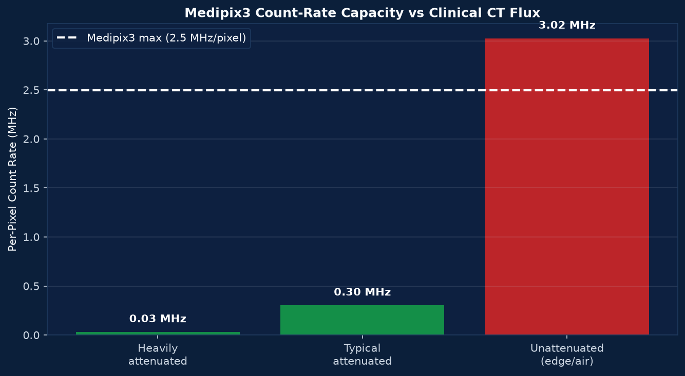

# Inspection Analysis Report

## Overview

This report summarises three notebook analyses from the SensTech detector simulation work:

- Baggage inspection: detecting a steel threat through increasing bag clutter.
- Food inspection: detecting steel, bone, and glass contaminants in food.
- Medical inspection: assessing Medipix3 with CdTe for medical CT-style photon-counting detection.

The explanations are written in a simple but professional form. The diagrams are taken from the notebook outputs in `analysis/notebooks/`.

---

## 1. Baggage Inspection Analysis

Notebook: `analysis/notebooks/babbageinspection.ipynb`

### Purpose

The baggage inspection analysis evaluates whether a 1 mm steel threat can still be detected when it is hidden behind different levels of baggage clutter.

The clutter is modelled as a water-equivalent material. This is a simplified way of representing common baggage contents such as clothes, books, plastics, and soft packed items. The model does not represent detailed object shapes, but it is useful for studying how increasing material thickness reduces detection performance.

### Method

The notebook compares two conditions at each X-ray energy:

- Clutter only, meaning baggage material without a steel threat.
- Clutter plus steel, meaning the same clutter with a 1 mm steel threat added.

The analysis uses three X-ray energies:

- 40 keV
- 60 keV
- 80 keV

It also uses five occlusion levels:

- None
- Sparse
- Medium
- Cluttered
- Extreme

The main detection metric is contrast-to-noise ratio, or CNR. A CNR value above about 3 is treated as a practical detectability threshold.

### Diagram: Detectability Versus Baggage Clutter

This diagram shows how CNR changes as clutter increases. A higher CNR means the steel threat is easier to distinguish from the background. The dashed line marks the CNR equals 3 detectability threshold.

### Diagram: Simple Detectability Summary

This traffic-light diagram summarises whether detection is easy, detectable, or hard at each energy and clutter level.

### Key Findings

At 40 keV, the steel threat gives strong contrast and remains detectable up to the cluttered level. However, under extreme clutter the photon count becomes very low, so the estimate is not reliable.

At 60 keV, the steel threat remains detectable up to medium clutter. Detection becomes weaker under cluttered and extreme conditions.

At 80 keV, the X-rays penetrate better, but the steel contrast is weaker. This makes the threat harder to detect, even when there is little or no clutter.

### Professional Interpretation

The baggage result shows a trade-off between penetration and contrast. Lower energy improves contrast for steel, but heavy clutter can block too much of the beam. Higher energy penetrates better, but the threat becomes less visually distinct from the background.

The most balanced region in this simplified test is around 40 to 60 keV, depending on how much clutter is expected.

### Limitations

The clutter is represented as a uniform water-equivalent layer. Real baggage contains irregular objects with different materials, densities, shapes, and overlaps. Therefore, this analysis should be treated as a controlled sensitivity study rather than a full baggage-screening simulation.

---

## 2. Food Inspection Analysis

Notebooks:

- `analysis/notebooks/food2.ipynb`
- `analysis/notebooks/food-inspection1.ipynb`

### Purpose

The food inspection analysis evaluates whether a CdTe Medipix3 detector can identify contaminants in food products.

The tested materials are:

- Steel
- Bone
- Glass

These materials are tested at different thicknesses and at three X-ray energies:

- 40 keV
- 60 keV
- 80 keV

### Method

The contaminant is not placed directly as a physical object inside Allpix. Instead, the expected attenuation is calculated analytically using the Beer-Lambert law and known material attenuation data. The reduced photon count is then simulated through the detector.

This means the notebook is mainly a detectability model. It estimates whether the contaminant would produce a measurable change in detector response.

The main metrics are:

- Transmission percentage: how much radiation passes through the contaminant.
- CNR: how strongly the contaminant stands out from the background.
- AUC: how well a statistical detector can separate clean and contaminated cases.
- Probability of detection at 5 percent false positive rate.
- Bhattacharyya distance: how different the charge spectra are between material classes.

### Diagram: Food Inspection Dashboard

This dashboard shows the core steel-contaminant analysis. It includes CNR, transmission, material separability, ROC curves, and count-rate behaviour.

### Diagram: Multi-Material Detectability Summary

This diagram compares steel, bone, and glass using a traffic-light format. Green means easy detection, amber means detectable, and red means difficult.

### Diagram: Material Discrimination Matrix

This heatmap compares how separable the different material spectra are. Higher values indicate stronger spectral separation.

### Key Findings

Steel is the easiest contaminant to detect. It strongly attenuates X-rays, especially at 40 and 60 keV. For example, 1 mm steel at 40 keV gives a high CNR, meaning it is clearly detectable.

Bone is moderately detectable. Thin bone is difficult to detect, especially at higher energies, but thicker bone produces enough attenuation to become visible.

Glass is the hardest material to detect in this analysis. Thin glass allows most photons to pass through, so it creates only a small change in signal. Glass detection improves at larger thicknesses, especially at 40 keV.

### Professional Interpretation

The food inspection results show that lower X-ray energies generally improve contaminant contrast. This is especially true for steel and thicker bone or glass. However, lower energy also increases absorption, so the best operating point depends on the expected contaminant material and product thickness.

For dense contaminants such as steel, 40 to 60 keV performs well. For weaker contaminants such as glass, detection is more challenging and may require optimised imaging geometry, better statistics, or multi-energy discrimination.

### Limitations

The analysis uses an analytical attenuation model rather than a full contaminant geometry inside the simulation. It also assumes a contaminant footprint of about 1 percent of the image area. Real food products may have variable texture, shape, density, and background structure, which can affect detection.

The earlier notebook `food-inspection1.ipynb` contains an execution issue from an old `np.trapz` call. The cleaner notebook for presentation is `food2.ipynb`.

---

## 3. Medical Inspection Analysis

Notebook: `analysis/notebooks/medicalinspect.ipynb`

### Purpose

The medical inspection analysis assesses whether Medipix3 with a CdTe sensor is suitable for medical CT-style photon-counting detection.

The main comparison is between:

- CdTe detector material
- Silicon detector material

The energy sweep covers:

- 20 keV
- 40 keV
- 60 keV
- 80 keV
- 100 keV
- 120 keV
- 150 keV

This range includes the typical diagnostic CT energy region.

### Method

The notebook loads simulated detector outputs for CdTe and silicon at the same energies. It compares how many photons are detected in each material, then calculates the relative efficiency advantage of CdTe.

It also estimates energy resolution by fitting Gaussian curves to the charge peaks in the CdTe spectra. The fitted full width at half maximum, or FWHM, is used as the energy resolution estimate.

Finally, it checks whether Medipix3 count-rate capability is suitable for clinical photon flux levels.

### Diagram: CdTe Versus Silicon Detection Efficiency

This figure shows that CdTe detects far more photons than silicon over the clinical X-ray energy range. Around 60 keV, CdTe is about 44 times more efficient than silicon in this simulation.

### Diagram: Energy Resolution

This figure compares the simulated CdTe energy resolution against published clinical detector ranges. The simulated result is much narrower than typical hardware values, which means the simulation is likely optimistic.

### Diagram: Count-Rate Capacity

This diagram compares expected clinical count rates with the Medipix3 per-pixel count-rate capacity. The result suggests comfortable headroom for attenuated diagnostic regions, with possible pressure near fully unattenuated beam edges.

### Key Findings

CdTe is much more efficient than silicon across the tested medical X-ray range. At 60 keV, the CdTe detector is about 44 times more efficient than silicon.

The simulated CdTe energy resolution ranges from about 1.07 to 1.77 keV FWHM. This is better than typical published clinical CdTe/CZT performance, so it should not be overclaimed.

The count-rate analysis suggests that Medipix3 has enough count-rate capacity for many attenuated diagnostic regions. It may become more limited at unattenuated beam edges where photon flux is highest.

### Professional Interpretation

The medical analysis supports CdTe as the stronger material choice for photon-counting CT energy ranges because it has much higher stopping power than silicon. This means more photons are detected, improving dose efficiency and signal quality.

However, the energy resolution result is likely optimistic because the simulation does not fully capture all real detector effects, such as charge sharing, electronics response tails, K-escape effects, and hardware calibration limits.

### Limitations

This analysis does not include CT image reconstruction or patient phantom image quality. It is a detector-level study, not a full clinical imaging-system evaluation.

The energy resolution values should be validated against real detector measurements before being presented as hardware-level performance.

---

## Overall Conclusion

The three analyses show that CdTe Medipix3 has strong potential across inspection and medical imaging tasks, but each application has a different limiting factor.

For baggage inspection, the challenge is detecting threats through clutter. Steel is visible at lower energies, but heavy occlusion can reduce photon statistics.

For food inspection, steel is highly detectable, bone is moderately detectable, and glass is the most challenging. Lower energies improve contrast, especially for dense contaminants.

For medical inspection, CdTe clearly outperforms silicon in detection efficiency across the clinical energy range. The main caution is that the simulated energy resolution is likely more optimistic than real hardware.

The results are useful as simulation-based feasibility evidence, but the strongest next step would be validation against measured detector data or more detailed object-level simulations.
